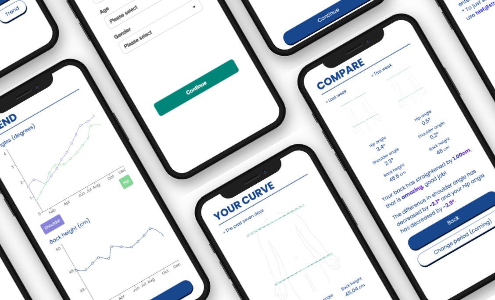

# Straighten

Straighten is a way for scoliosis patients to monitor and manage their curvature over time.

You can try the app over at https://straighten.vercel.app



For more detailed information, check out [the slides](https://speakerdeck.com/ddikman/hackathon-app-idea).

**Please note:**

Unfortunately, the idea I had for creating this app together with Bodygram's APIs didn't pan out. It turns out that the shoulder and hip angles are straight even for some suffering from scholiois. The slides above gives more information and some ideas of other ways to work around this. Regardless, this repo can act as a PoC idea of how an app like it would work.

## Running the app

The app uses [Bodygram's](https://bodygram.com/en/) body scanning platform to capture posture data. It stores this in a Supabase database.

Before running the app, you will need to add the following settings:

```shell
export API_KEY="Your Bodygram API key"
ORG_ID="Your Bodygram organisaion key"

NEXT_PUBLIC_SUPABASE_URL="URL to your supabase instance"
NEXT_PUBLIC_SUPABASE_ANON_KEY="The supbabase anonymous key"
```

## Authentication

The app authentication isn't authentication as much as just splitting users for the sake of splitting users. You "log in" by giving the app an email which it will use to store your data.

## Database setup

Just add a single `scans` table using this SQL and you should be good to go:

```sql
CREATE TABLE IF NOT EXISTS "public"."scans" (
    "id" "uuid" DEFAULT "gen_random_uuid"() NOT NULL,
    "created_at" timestamp with time zone DEFAULT "now"() NOT NULL,
    "email" character varying,
    "data" "json"
);
```

## Scanning

To do the scan, you have to run the app on a mobile phone. Furthermore, you have to be using https to be able to get the permissons to the camera.

An easy way to get https access is to tunnel traffic to your local machine using [ngrok](https://ngrok.com/);

```
ngrok http 3000
```
